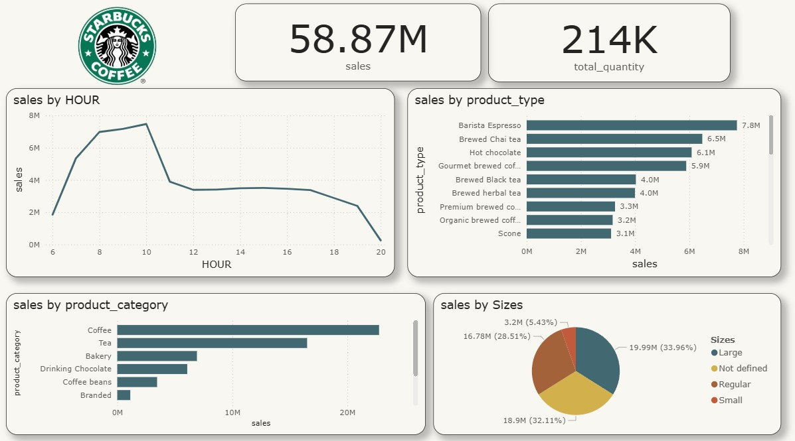

# Starbucks Coffee Sales Dashboard ☕📊

This project is a *Power BI Dashboard* for Starbucks sales data.  
It shows key insights like top products, sales by hour, and customer preferences.

## 📊 Key Insights
- Total Sales: 58.87M  
- Quantity Sold: 214K  
- Best Product: Barista Espresso (7.8M)  
- Peak Time: 8 AM – 10 AM  
- Most Popular Category: Coffee  
- Favorite Sizes: Large & Regular  

## 📂 Files in this Repository
- Starbucks_Dashboard.pbix → Power BI dashboard  
- starbucks_sales.csv → Dataset  
- dashboard_screenshot.jpg → Dashboard preview image (optional)  
- README.md → This file  

## 🚀 How to Use
1. Download the files.  
2. Open Starbucks_Dashboard.pbix in *Power BI Desktop*.  
3. Explore the dashboard.  

## 📸 Dashboard Preview

